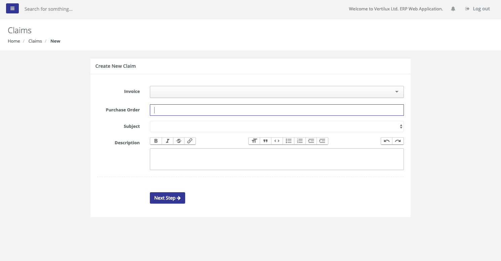

# Claims

## Create a Claim

To create a claim you need to select an Invoice, Subject and enter a brief Description, then hit Next Step button.

### Subject

The claim must include on the subject one of the below categories:

* Motors defective
* Fabric defective \(Cuts\)
* Components defective
* Extrusions defective
* Mislabeled
* Wrong Cost
* Wrong Color
* Transportation Damage

On this window, you can attach an image if necessary, select the item within the invoice previously selected and enter the quantity.

Be aware after you hit submit button you cannot modify your Claim, so you need to confirm the information entered is correct.

Once submitted you will get a claim number and our Quality Control \(QC\) department will review your claim and find the quickest solution to resolve your issue. You will receive notifications when the QC department start working and updating the status of your claim.

### Claim Statuses

1. Not Placed \(not submitted, on this step you can still make updates\)
2. Pending \(submitted but not in process\) 
3. Processing
4. Approved
5. Rejected
6. Archived

## Follow Up

From the claim view you can follow up for your claims, we have aggregated your claims by status, user name, invoice number, items and subject. This aggregation menu will allow you to filter your claims much easiest.

