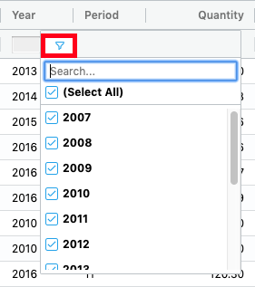
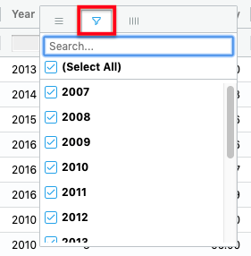

# Customer Profile

## Profile

This tab includes some basic information about your company like Address, Sales Representative, Sales Trend, Order Process in the last 36 months and Sales in the last 5 years.

## Receivable

The receivable tab contain information related to your company dues and over-dues, including the aging and amount by 0-30, 31-60, 61-90 and more than 90 days.

## Opened Orders

Open Sales Orders is where the order has not been delivered \(physical goods\). This list is a detailed lists containing the items, sales order status, days opened, days in process, quantity ordered, quantity commit, etc.

**Qty Commit**: quantities dedicated to that particular order.

### **Sales Order Status**: 

* **Backorder**: Sales Order \(not shipped or in process\) waiting for new stock to arrive.
* **Fulfillable**: Capable of being fulfilled.
* **Work in Process**: Our warehouse force is working on already.

## Backorders

Lists of items on sales order \(not shipped or in process\) waiting for new stock to arrive.

## Sales History

Sales History tab contain summarized sales revenue data for a specified number of months \(Period\) and years.

### Grouping / Aggregation:

The Grid allows the user to group the data by specific columns. To group the data, drag the desire column header to the row group area.

Alternatively, you can group by dragging a column from the tool panel to the tool panel row group area.

Once grouped, you can display aggregation values for given column. To aggregate a given column, drag a column to the aggregation area.

You can also select a value aggregation function for a given column from the tool panel or the column menu.

### Filtering:

The Grid comes with an extensive set of built-in column filter types. The floating filter row provides quick access to the User Interface \(UI\).

An additional UI for filtering is provided in the column menu. Hover the column, press the hamburger icon, then select the second tab.


Grouping and Filtering also apply for the others tables.


## Documents

The Documents tab contains a list of AR invoices, credit notes, debit notes, interest charges, receipts \(including unapplied cash, prepayments, and miscellaneous receipts\), and refunds which have been processed.

