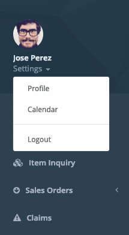
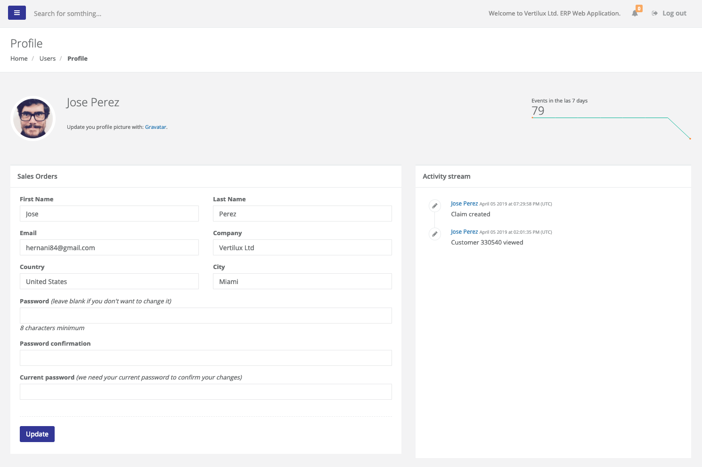

# User Profile

## Updating your profile 

You can update you profile from the main menu by clicking on Settings / Profile. 

You can update your name, email, company, country, password and also see you activity stream. If you want to change your avatar, you create an account a [Gravatar](https://en.gravatar.com/) account with your email and your avatar will change automatically.

