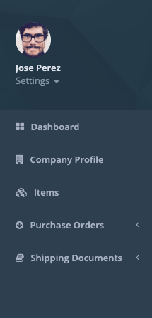

# Quick Start

## Sign Up

The basic access workflow:

1. [Register in our ERP web application.](https://erp.vertilux.com/users/sign_up) 
2. [Request Access.](https://erp.vertilux.com/request_access)
3. Validate your Account:

The system will randomly choose an invoice, enter the total amount.

If the entered amount is correct the system will give you access automatically and you'll see a success banner:


 Your account has been successfully validated, Enjoy!


## Dashboard

The dashboard is an information management tool to visually track, analyzes and displays key performance indicators \(KPI\), metrics and key data points to monitor your account. Your dashboard allows you to view KPIs:

* Open Purchase Orders
* Items
* Documents
* Pending Documents
* Purchases in the last 5 years
* YTD \(year to date\) Purchases
* Total purchases current year

This KPIs allows you to quickly get important information without sifting through spreadsheets or emails.

## Navigation Menu 

 Navigation Menu or simple Menu is a section intended to accessing information.

