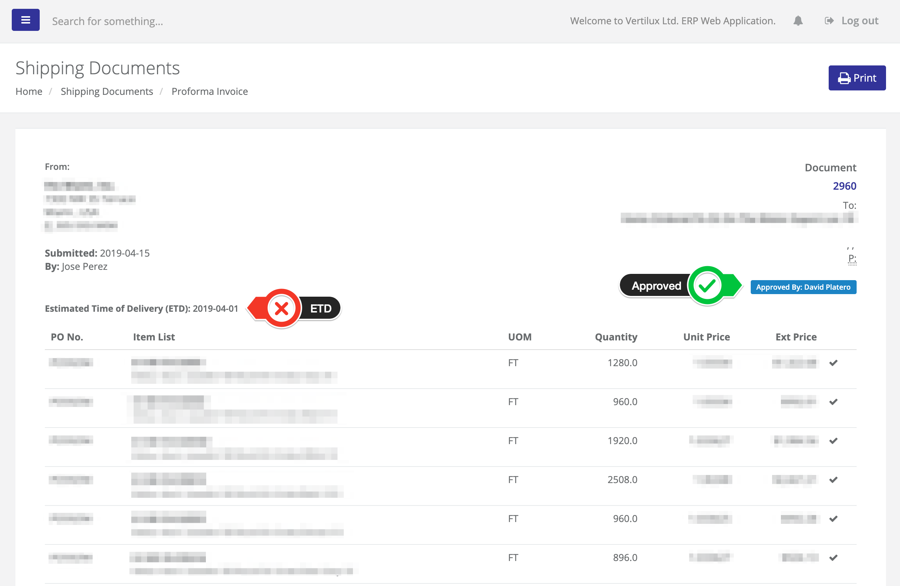

# Documents

All the documents submitted will be available for local printing.

These records are kept in our database and you can see it from your side as well as we can see them in our side, both, you and us, will have the same information available for that document.

All the approvals will be in the system and when approved, you will receive an e-mail with the approval for your records. In Any event, you can always PRINT the SCREEN to keep your records, should you have a difficult printing them in a normal way.

We are trying to set up the items we purchase from you, this information will include:  

1. The packing, as prearranged with us, depending on the type of product, however, for components, this quantity must be exactly the same every single time. Shipments must be of complete boxes or bags as prearranged with us.
2. The Weights, Net Weight and Gross Weight, these two must be the same always per unit of measure \(UOM\).The total will be calculated by multiplying the quantity \(per pack to obtain the line weights, or total for the grand total per item\) times the Unit Weight.The only exclusion would be the aluminum extrusions since there are tolerances that will make the weight vary.
3. The UNIT PRICE. Once approved by both and established in the list, they cannot be changed unless it's approved by both.

## Creating a Documents

From the documents index view click on New Document \(as show in the screenshot below\) button and and choose the document required to work on:

### **Proforma Invoice** 

A proforma invoice is a preliminary bill of sale approved by Vertilux in advance of a shipment or delivery of goods. The invoice will typically describe the purchased items and other important information such as prices, quantities and Estimated Time of Departure on Delivery \(ETD\).

### **Packing List**

A packing list is a document that includes details about the contents of a package. The packing list is intended to let transport agencies, government authorities, and customers know the contents of the package. These details help each of these parties handle the package accordingly.

#### Adding Items or Import them to the Packing List

Once the Packing List is created the document lines will be blank, meaning no items listed on the document, at this point you can start adding the items or import them from a CSV \(Comma Separated Value\) file.



First select the Purchase Order and them the form will list the Items included in the Purchase Order selected, after select the Item, the fields Quantity and Price will be populated with the original quantity and price from the previous Proforma Invoice. Quantity can be change depending on the quantity produce and packed. Enter manually the Box Number, Gross and Net weight \(please be aware Net and Gross weight needs to be per units.




Lines can import the Packing List as CSV from a template you can download by clicking on the [Link](https://s3.amazonaws.com/erp-accpac/templates/document_lines.csv) as show in the image below.

The template \(see the following image\) contain 8 columns:

1. **ponumber**: Purchase Order Number
2. **itemno**: Vertilux's Item Number
3. **quantity**: Quantity Packed
4. **box\_no**: Box Number
5. **gross\_weight**: Gross Weight per units
6. **measure\_gross\_weight**: Gross Weight unit of measure \(UOM\)
7. **net\_weight**: Net Weight per units
8. **measure\_net\_weight**: Net Weight unit of measure \(UOM\)

Make sure the CSV file contain Purchase Orders that has been already selected on the Packing List \(when the document was created\), the Items entered are included on the Purchase Order and the rest of the fields were filled-out; otherwise you will get errors indicating the line and the error. Error example:


Line 7 - 0-000-01-08000 cannot be found.


If everything is fine after the import you'll get a messages saying the No. of lines imported:


Imported 19 lines.




### **Commercial Invoice** 

The commercial invoice is a legal document between the supplier and the customer that clearly describes' the sold goods, and the amount due on the customer. The commercial invoice is one of the main documents used by customs in determining customs duties.

This document belongs to a Packing Lists, before creating it first needs to be created a Packing Lists. It will select all the items previously included on the Packing Lists and it will create a summary with the approved prices in the Proforma Invoice.

### **Bill of Lading**

A bill of lading is a document issued by a carrier to acknowledge receipt of cargo for shipment.

### **Importer Security Filing \(ISF\)**

An ISF, also known as 10+2, is a filing required by the CBP that documents importing information and details, as shipments pass from point to point. Importers who do not file the ISF properly prior to the shipment of their goods will be penalized \(US$5,000 fine\).

## Updating Documents

Keep in mind that you can always modify your documents before it has been submitted, these actions works for all documents, in this case we are using a Packing Lists as example.

You can update and delete lines \(see image below\).

### Update Lines Modal

## Submit & Delete Documents

After you reviewed your document and all information if fine, you can proceed to submit your document; be aware that once a document is submitted cannot be modified.

Delete action can be done only is the document is not submitted.

