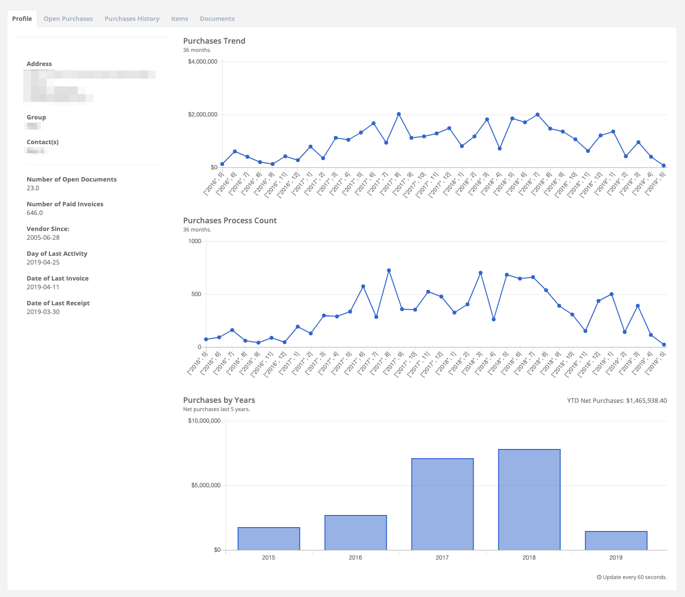
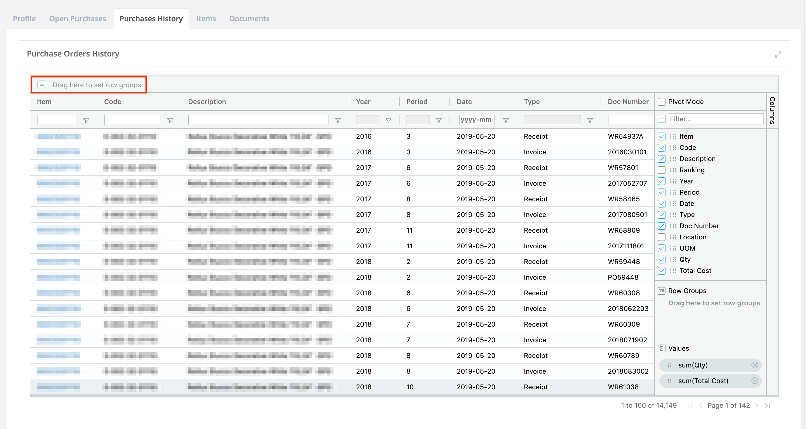
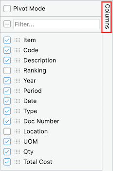
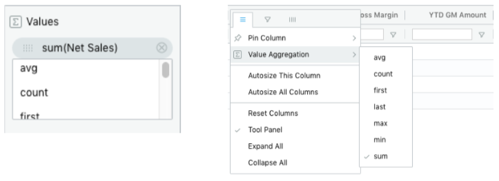
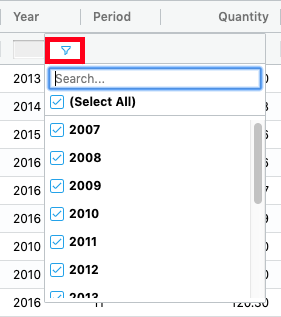
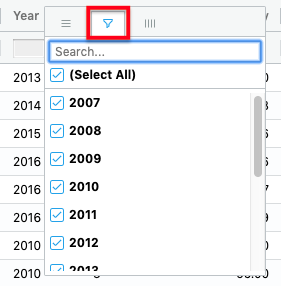

# Company Profile

## Profile

This tab includes some basic information about your company like Address, contact person, Purchase Trend, Purchase Orders Processes in the last 36 months and Purchases in the last 5 years.

## Open Purchases

Open Purchase are Purchase Orders which has been issued to a vendor, against which specified purchases may be made for a specified period of time. The list is a detailed lists containing:

* Purchase Orders
* Purchase Order Date
* Days Open
* FOB
* etc.

## Purchases History

Purchases History tab contain detailed purchases data for a specified number of months \(Period\) and years.

### Grouping / Aggregation:

The Grid allows the user to group the data by specific columns. To group the data, drag the desire column header to the row group area.

Alternatively, you can group by dragging a column from the tool panel to the tool panel row group area.

Once grouped, you can display aggregation values for given column. To aggregate a given column, drag a column to the aggregation area.

You can also select a value aggregation function for a given column from the tool panel or the column menu.

### Filtering:

The Grid comes with an extensive set of built-in column filter types. The floating filter row provides quick access to the User Interface \(UI\).

An additional UI for filtering is provided in the column menu. Hover the column, press the hamburger icon, then select the second tab.


Grouping and Filtering also apply for the others tables.


## Items

The Items tab contains a list of items associate to the vendor, it also include the vendor's item number \(or item code\).

## Documents

The Documents tab contains a list of AP invoices, credit notes, debit notes, receipts \(including prepayments, and miscellaneous receipts\), and refunds which have been processed.

